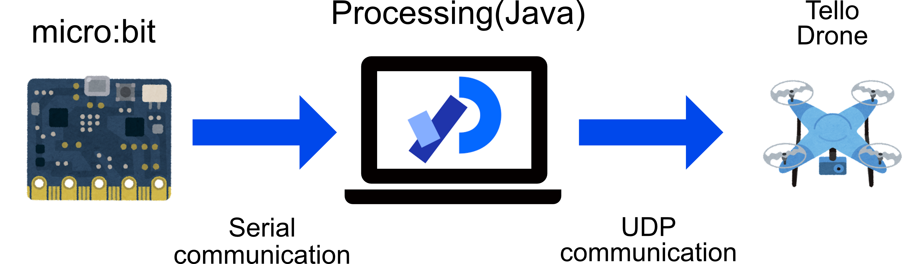

# Tello Drone Control Processing and micro:bit

This repository shows how to operate a drone using [Processing](https://processing.org/) and [micro:bit](https://microbit.org/ja/).

## Processing using library
- [serial](https://processing.org/reference/libraries/serial/index.html)
- [udp](https://ubaa.net/shared/processing/udp/)

I could not use the latest UDP library. I have the UDP libraries I used in the repository.

## Micro:bit code
Simple  
https://makecode.microbit.org/S70876-27321-00007-77896  
RC  
https://makecode.microbit.org/46595-70948-17917-88483  

## How to

1. Download the micro:bit code.
2. Install two libraries in Processing.
3. Ensure that the MicroBit is connected to the PC.
4. Access the Tello drone's WiFi from your PC.
5. Execute Procssing code.

以下に日本語の解説も載せておきます．
https://qiita.com/kikpond15/items/d7d6c21221e4dfb93474

## Demo RC controller

